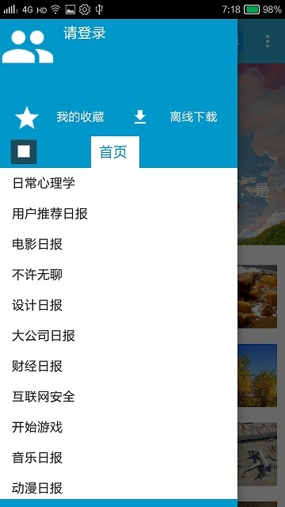
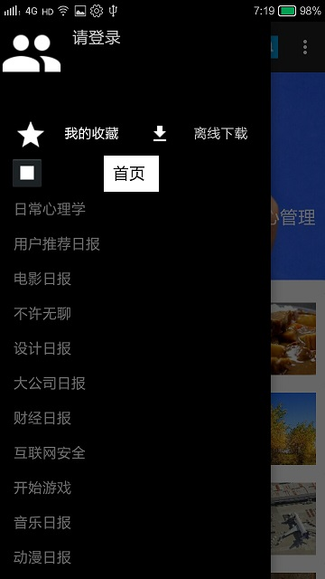
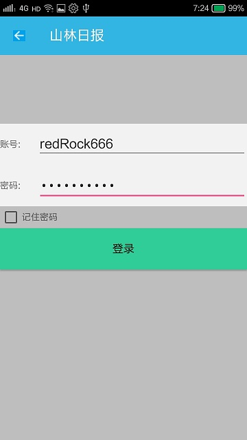
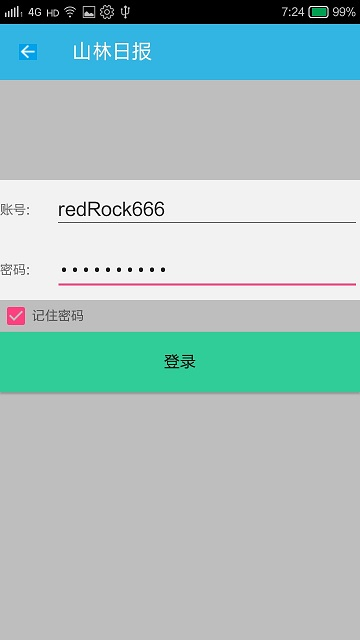
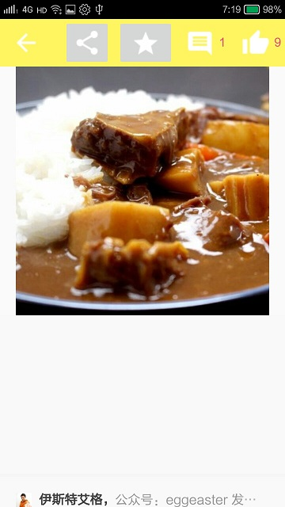
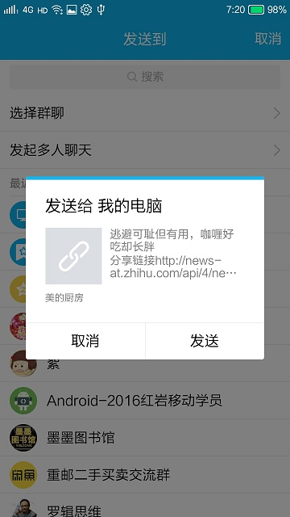
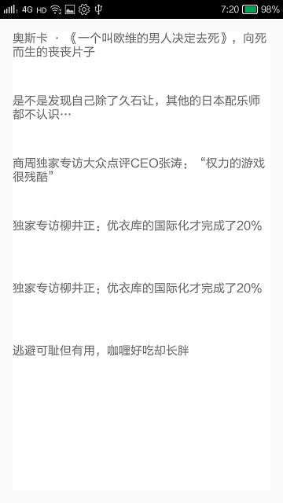
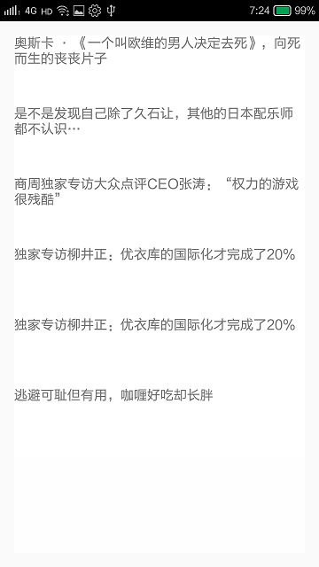

####  知乎日报
#####红岩网校的考核作业，知乎日报的不完整盗版--山林日报      
#####做完的感受是自己还是很菜，话不多少，直接上效果说明和图片   
#####具有的功能如下  
#####1、查看首页及主题日报和其中的具体内容（即是说所有的接口）
#####2、收藏功能
#####3、登录功能
#####4、分享功能
#####5、区分已读和未读
#####先来看图片
#####首页，如图所示：
#####,
#####点击首页右上角的菜单按钮之后，效果如图：
#####,
#####点击首页左上角的菜单按钮之后，效果如图：
#####
#####点击首页右上角的夜间模式按钮，效果如图：
#####
#####点击首页右上角的登录按钮，效果如图：
#####,
#####输入登录的账号和密码之后，效果如图
#####
#####点击记住密码之后，效果如图
#####,
#####一次登录之后，会记住登录状态，不需要重复登录。
#####登录之后的效果图:
#####
#####点击新闻之后，效果如图
#####   
#####
#####点击分享按钮之后，效果如图
##### 
#####点击发送给QQ好友，效果如图
#####
#####点击发送给QQ好友里面的我的电脑，效果如图
#####
#####点击收藏按钮，效果如图
#####   
#####
#####点击评论按钮，效果如图
#####     
#####
#####区分已读未读，效果如图
#####
#####点赞之后上面的图标数值会+1,效果如图
#####
#####    
#####光说了好的，现在来说说bug
#####1、夜间模式不完整，这个你们检测的时候就知道了。
#####2、如果要知道新闻是已读还是维度，必须要点击之后返回主界面，然后刷新才能显示出来，区分已读未读。
#####3、电影日报里面有的文章点进去是null，原因的话，我还不知道。
#####4、如果评论数量过少，根本加载不出来。
#####5、评论里面似乎有偶尔有重复的。
#####6、登录的时候的界面密码和账号只能是redRock666，因为后台是这样设置的。
#####7、"请登录"字样的按钮未注册监听器事件，登录按钮只能在首页的界面实现。
#####8、分享到微信不能实现，不知道为什么，根据网上的说法，有什么md5签名和微信程序签名，还有的说什么混淆代码。不是很懂。但是我的APK在微信开放平台里面上传创建并且通过了，不过不是这个版本的，之前的版本是通过的，这一次commit的没有过。
#####9、引用的库不多，但是写上去的很多，因为我之前想的和我实现的完全不一样，然后也没有上去了。
#####10、本来是想详细的写一写注释的，但是似乎时间不够了。












